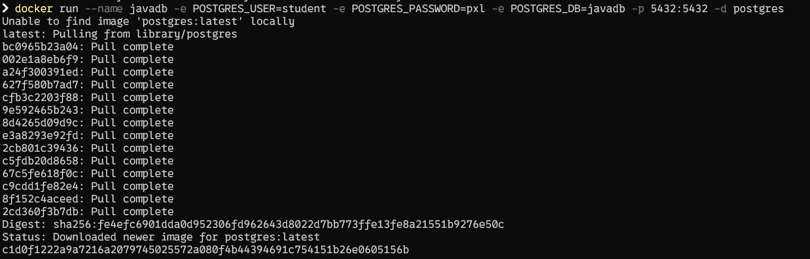
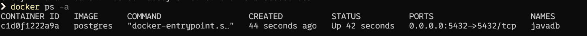
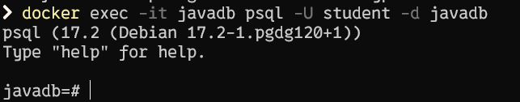
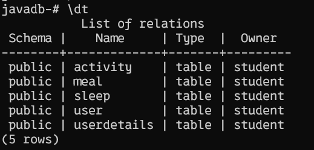
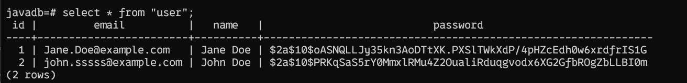

# Project Documentation

## REST Endpoints
### 1.1 Authentication & Database Connection

- Fixed authentication and can now connect to the H2 database.
- Access the H2 Console at: `http://localhost:8081/h2-console`
- Log in using:
  - **Username**: `sa`
  - **Password**: (blank)
  - **JDBC URL**: `jdbc:h2:mem:testdb`

#### WebSecurityConfig Changes:
- Allowed unauthenticated access (might need to change later).
- Disabled CSRF and allowed frames to solve the "refused connection" error.
- Configured to be stateless.
- Defined specific paths with different security rules.
- Default rules applied for all other requests.

**Note:** I'm not sure if we are allowed to change the `WebSecurityConfig` file since it was provided, but these changes were necessary to resolve issues.

### 1.2 User Update Bug Fix
- **Register User**: `POST /users` accepts name, email, and password.
- **Update User**: `PUT /users` updates user details like weight, height, and birthdate. Age is calculated dynamically with `getAge()`.

- Fixed the bug where the user's weight, height, and birthdate could not be updated.
- Implemented `getAge()` functionality for the user.

**How to Test:**
- Use Basic Authentication in Postman with the username and password of the user you're updating. This will ensure authentication works correctly.
- If you try to update a user that doesn't exist, the request will fail.

### 1.3 Activity Registration
- **Register Activity**: `POST /activities` allows users to register activities (e.g., running, cycling) along with duration and distance.
- Calories burned are calculated using the **Nutritionix API**.
  
### 1.4 Get Activities
- **Get All Activities**: `GET /activities` returns all activities for the authenticated user.
- **Get Specific Activity**: `GET /activities/{activityId}` fetches details of a specific activity.

### 1.5 Delete Activity
- **Delete Activity**: `DELETE /activities/{activityId}` allows users to delete their own activities. A 403 error is returned if attempting to delete someone else's activity.

### 1.6 User Statistics
- **Get Statistics**: `GET /activities/statistics` provides data for a user, including total calories burned, activity count, heaviest and longest activity, and more.

### 1.7 Activity Type Statistics
- **Get Stats for Specific Activity**: `GET /activities/{sport}` calculates total calories, distance, and time for a specific activity type (e.g., running, cycling).


## 2 CRUD (Create - Read - Update - Delete)

### 2.1 Meals

**SQL Queries:**
- To get all meals for a specific user:
  ```sql
  SELECT m.*
  FROM MEAL m
  JOIN "user" u ON m.user_ID = u.ID
  WHERE u.EMAIL = 'Jane.Doe@example.com';

- Or filter meals by user ID:
  ```sql
  SELECT m.*
  FROM MEAL m
  WHERE m.USER_ID = 1;

#### DTOs for Meal:
- MealRegisterRequest: Represents the data received from the client when creating or updating a meal (input).
- MealResponse: Represents the data sent back to the client when fetching meal details (output).

### 2.2 sleep

**SQL Queries:**
- To get all sleep records for a specific user:
  ```sql
  SELECT * 
  FROM SLEEP
  WHERE USER_ID = 1;


#### Error Handling:

The service layer defines error conditions and throws exceptions with relevant messages.
The controller layer catches these exceptions, determines the appropriate HTTP status code, and includes the error message in the response.

## 3 Unit tests
Unit tests for all the services have been written to ensure CRUD operations and error handling 

## 4 Using a PostgreSQL Database
Run the following command to start a PostgreSQL container:
``docker run --name javadb -e POSTGRES_USER=student -e POSTGRES_PASSWORD=pxl -e POSTGRES_DB=javadb -p 5432:5432 -d postgres``
```bash
  --name my-postgres-db: Names the container my-postgres-db.
  -e POSTGRES_USER=student: Sets the database username to myuser.
  -e POSTGRES_PASSWORD=pxl: Sets the database password to mypassword.
  -e POSTGRES_DB=javadb: Creates a database named mydb.
  -p 5432:5432: Maps port 5432 of the container to 5432 on your host machine.
```

  - No need to run docker build because we are using an existing image (postgres) from Docker Hub




Check that the container is running: 
``docker ps``



Connect to the PostgreSQL database inside the container:
``docker exec -it javadb psql -U student -d javadb``



The application uses the **application.properties** file to configure the database connection. Ensure the following settings are included:

```properties
  spring.datasource.url=jdbc:postgresql://localhost:5432/mydb
  spring.datasource.username=myuser
  spring.datasource.password=mypassword
  spring.datasource.driver-class-name=org.postgresql.Driver
  spring.jpa.database-platform=org.hibernate.dialect.PostgreSQLDialect
  spring.jpa.hibernate.ddl-auto=update
```

List all tables
``\dt``


View the meal table to confirm data:
``SELECT * FROM "user";``


## 5 Deployment in cloud
--